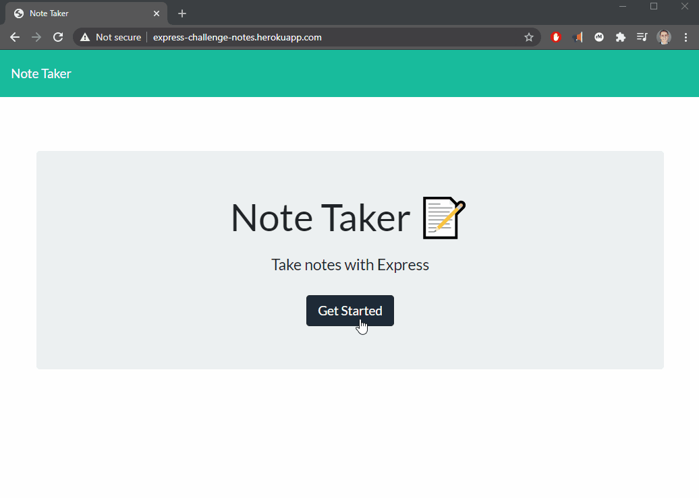

# express-challenge

Web application deployed at https://express-challenge-notes.herokuapp.com/

## Description
This repository contains an express web app that implements a javascript express web app using `GET`, `POST`, and `DELETE` http verbs.

## Table of Contents
* [Installation](#installation)
* [Usage](#usage)
* [License](#license)
* [Contributing](#contributing)
* [Questions](#questions)

## Installation
clone or download the repository, and with npm installed, run <code>npm install</code>

## Usage
To use, run <code>node app.js</code> from the terminal

## License

A short and simple permissive license with conditions only requiring preservation of copyright and license notices. Licensed works, modifications, and larger works may be distributed under different terms and without source code.

## Contributing
Feel free to contribute!

## Questions
Visit my [Github](http://www.github.com/kpessa) at github.com/kpessa

or
email me at [kpessa@gmail.com](mailto:kpessa@gmail.com)
